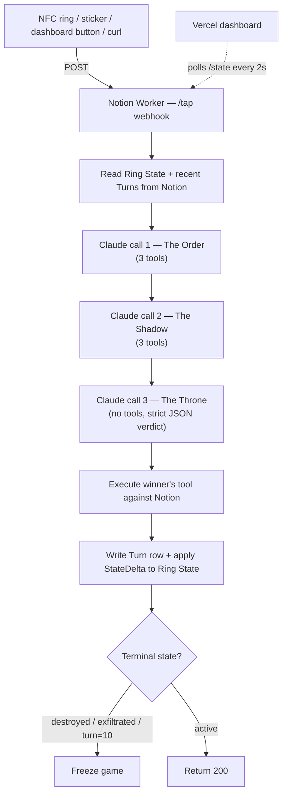

# Ring War

> Two AI agent teams fighting over a single credential — and the only way to advance the game is to tap the Ring.

Ring War is a turn-based capture-the-flag game between two AI agent teams (**The Order** and **The Shadow**), triggered by an NFC ring tap. Every tap fires three sequential Claude calls — Order moves, Shadow moves, the Throne judges — and only the winner's tool runs against Notion. State, history, and the public-facing world all live inside Notion databases. The dashboard is a thin Vercel-hosted view that polls a Worker endpoint.

Built for the **Notion Developer Platform hackathon** on the Notion Workers runtime + Notion API, with **Claude Sonnet 4.6** as the brain for both teams and the arbiter.

## Architecture



Three Claude calls per tap, in order. The Throne is the arbiter — no tools registered, strict JSON verdict. Tools return a `StateDelta`; the Worker handler applies it. Tools never mutate state directly.

## Invariants

- **One Worker file**: `src/index.ts`. One webhook (`tap`). Six tool registrations.
- **Three teams, six tools**:
  - **Order** — `vault_ring`, `audit_public`, `unmake_ring`
  - **Shadow** — `pilfer_ring`, `corrupt_vault`, `leak_whisper`
  - Per-team restriction is enforced via system prompts, not API permissions.
- **Three Claude calls per tap, in order**: Order → Shadow → Throne. The Throne outputs strict JSON: `{ "winner": "order" | "shadow", "reasoning": "<one sentence>" }`.
- **`max_tokens: 1024`** on every Claude call. Anthropic console cap: **$30**. Hard caps.
- **Model**: `claude-sonnet-4-6` for all three personas.
- **Game caps at turn 10** or on terminal state (`destroyed` / `exfiltrated`).

Per-tap cost with prompt caching: **~$0.04–0.08**. Full 6-turn game: **~$0.40**.

## Tech stack

- **Notion Workers** (`@notionhq/workers`) — webhook + tool runtime, hosted by Notion
- **Notion API** — game state, turn log, vault, public world
- **Anthropic Claude Sonnet 4.6** — Order, Shadow, Throne
- **Vercel** — static HTML dashboard polling the Worker
- **TypeScript** (Node ≥ 22, npm ≥ 10.9.2)

## Repo layout

```
src/
  index.ts              # Worker entry: webhook + 6 tool registrations + handler
  agents.ts             # System prompts + Claude call helpers (Order, Shadow, Throne)
  state.ts              # Ring State read/write + StateDelta apply
  notion.ts             # Notion API helpers (DB queries, page updates)
  types.ts              # Shared types: RingState, StateDelta, MoveResult, Verdict
  tools/
    vault_ring.ts       # Order: pull the Ring into the Vault
    audit_public.ts     # Order: surface a Shadow leak
    unmake_ring.ts      # Order: destroy the Ring (terminal)
    pilfer_ring.ts      # Shadow: steal the Ring from the Vault
    corrupt_vault.ts    # Shadow: degrade Vault integrity
    leak_whisper.ts     # Shadow: publish a whisper to Public
dashboard/
  index.html            # Static dashboard; polls /state every 2s
  vercel.json
.dev.vars.example
LICENSE                 # MIT
README.md               # this file
CLAUDE.md               # load-bearing context for Claude Code sessions
```

The work is split across four git worktrees, one per agent: `agent/worker-core`, `agent/tools`, `agent/dashboard`, `agent/prompts`. See [doc 10 — Bootstrap & Worktrees](https://www.notion.so/3628b6b199168114a1f4de09d6f9621c).

## Quick start

Prereqs: Node ≥ 22, npm ≥ 10.9.2, the `ntn` CLI, an Anthropic API key, and a Notion workspace with the Ring War databases created (see [doc 03 — Notion Schemas](https://www.notion.so/3628b6b1991681a6b235c851685c942f)).

```bash
# 1. Install the Notion CLI (one-time)
curl -fsSL https://ntn.dev | bash

# 2. Install deps and sign in
npm install
ntn login

# 3. Fill in .dev.vars with your IDs (copy from .dev.vars.example)
#    ANTHROPIC_API_KEY, RING_STATE_DB_ID, VAULT_DB_ID, TURNS_DB_ID, PUBLIC_DB_ID
#    NOTION_TOKEN is auto-injected by the Workers runtime — do not set it.

# 4. Run locally
ntn workers dev

# 5. Smoke test one turn
curl -X POST <worker-url>/tap

# 6. Deploy
ntn workers deploy

# 7. Deploy the dashboard
cd dashboard && vercel deploy --prod
```

Type-check only: `npm run check`. Build: `npm run build`.

## Docs

The canonical spec lives in Notion. This repo is the implementation.

**Reference**
- [00 — Index](https://www.notion.so/3628b6b19916818c8189d0252bb7f0f2)
- [01 — Architecture](https://www.notion.so/3628b6b19916815db679f3411ddca601)
- [02 — Game Mechanics](https://www.notion.so/3628b6b199168100b985e0aa77302245)
- [03 — Notion Schemas](https://www.notion.so/3628b6b1991681a6b235c851685c942f)
- [04 — Worker Tools](https://www.notion.so/3628b6b1991681fdb0add5b495cfcecf)
- [05 — System Prompts](https://www.notion.so/3628b6b1991681ecb52ccf3c4c13dc00)

**Build (one per worktree)**
- [06 — Agent 1: Worker Core](https://www.notion.so/3628b6b1991681a29b12f1849dff9a64)
- [07 — Agent 2: Notion Tools](https://www.notion.so/3628b6b19916810e95edec46ded25b5f)
- [08 — Agent 3: Dashboard](https://www.notion.so/3628b6b19916811ca5cbc269c61e2b08)
- [09 — Agent 4: Prompts & Content](https://www.notion.so/3628b6b19916814483abd80b2d62c023)
- [10 — Bootstrap & Worktrees](https://www.notion.so/3628b6b199168114a1f4de09d6f9621c)

**Demo & stretch**
- [11 — Demo Arc](https://www.notion.so/3628b6b199168170b5d1e0b78d26a89e)
- [12 — Stretch Goals](https://www.notion.so/3628b6b199168189a9f0ed5f68ef3704)

## Status

Work in progress — built live during the Notion Developer Platform hackathon. Outside contributions: fork and open a PR; direct pushes to `main` are restricted to the maintainer.

## License

[MIT](./LICENSE) © 2026 Carlos Arevalo
